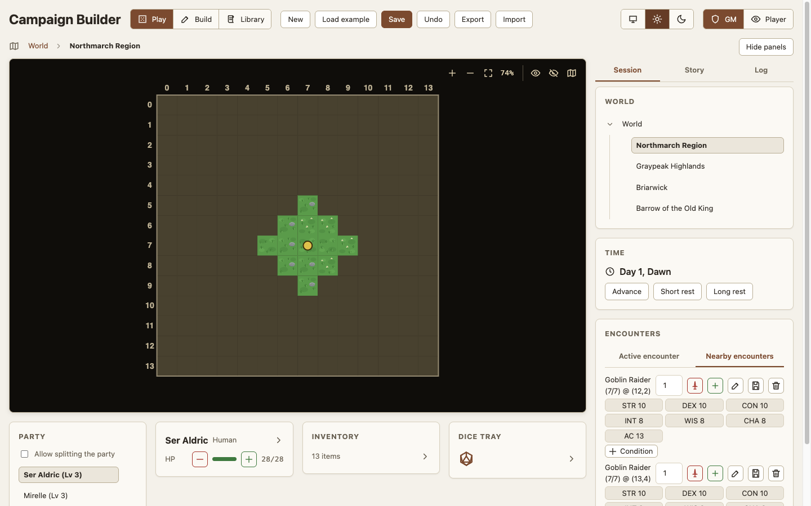
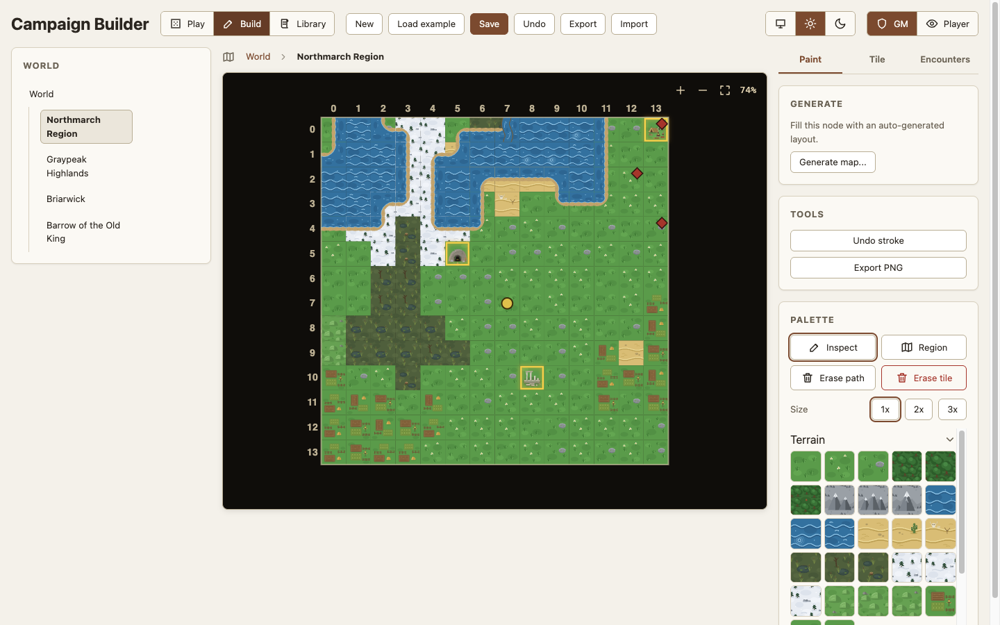
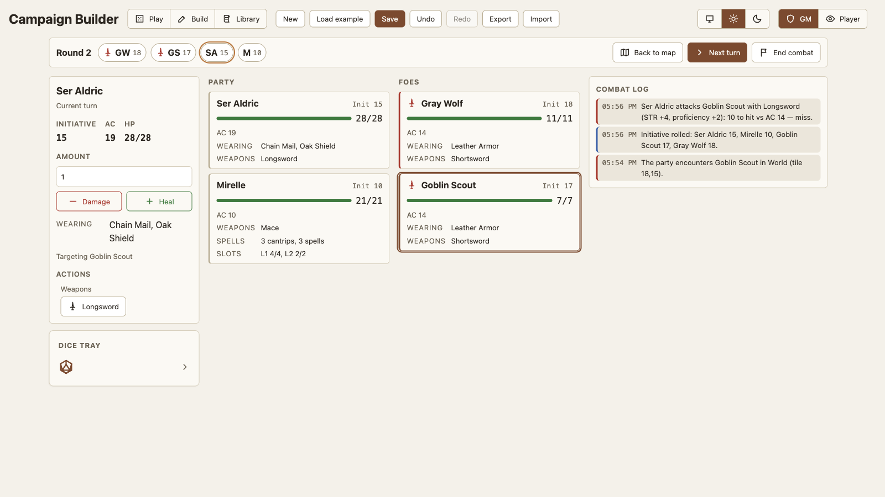
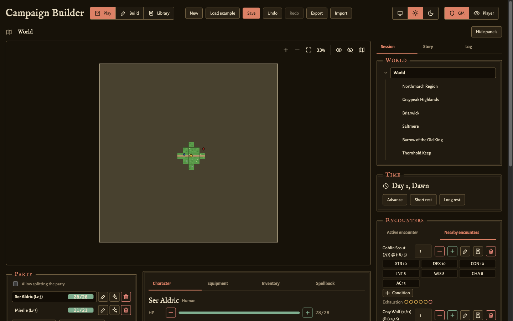

# Campaign Builder

This project is a self-contained suite that creates and manages the world of a D&D campaign, or an equivalent campaign. It does not act as the GM. The suite only shows the world that the players move through.

## Features

With Campaign Builder, you can:

  - Build a tiled world visually, with regions, sub-regions, and major and minor points of interest
    - You can use a set of pre-built tile images. You can also supply your own tile images. [WIP]
    - Each tile carries metadata. You use the metadata to mark major features that players can find and interact with.
    - Groups of tiles form a hierarchy. A world contains regions. A region contains sub-regions, and so on.
    - You can zoom in and out of the different levels of the hierarchy. For example, you can zoom from a region into one sub-region to show its point-of-interest tiles.
    - The way back out depends on the links that you already drew. You can walk off a sub-region on any side that touches the map above it. An interior area leaves through its outer door or through the staircase that connects it to the level above or below. Build mode warns you when a node has no way in or out.
    - You can reveal parts of the map as your party travels. Unexplored areas stay grayed out until your party moves closer.
    - You can track your party's location on the map at all times.
  - Populate the world with creatures, from major enemies with life tracking to friendly and neutral NPCs, all in one list
  - Run fights on a full-width combat screen. The screen shows a turn ribbon above the initiative order. Combatant cards work as target pickers, and each card shows what the combatant wears, swings, and holds in spell slots. One-click attack and cast buttons appear for the combatant whose turn it is. The combat log and dice tray sit alongside the screen. A player on a bound tab runs the turn of their own character. After the last enemy is defeated, the fight stays open until the GM ends it.
    - Before the fight starts, the Encounters panel rates it for the GM alone: what the foes on the party's tile are worth in experience points, against the budget of the party's levels. A creature carries a challenge rating and the saving throws and skills it is trained in, and the app works out every bonus from those.
  - Add resource tracking (items, D&D-style spell slots, and other resources that a character can use up)
  - Add character sheets with full character stats. A sheet shows class and subclass, race, background, and assembled proficiencies. A sheet shows hit dice and spellcasting. A sheet tracks level and progression, with class assignment at each level. A sheet supports multiclassing and choices for an ability score improvement or a feat. A feat comes from an editable catalog in the library, and its ability increases, proficiencies, and roll bonuses apply to the sheet when you take it. A class feature with choices, such as the Expertise of the Rogue, prompts its picks at level-up and applies them the same way.
  - Simulate dice rolls and their results for any combination of dice that an interaction needs
  - Curate a library of equipment, creature, spell, and feat templates that is independent of the campaign (the Library mode in the header). The library lists the built-in 5e defaults, and you can customize each one separately. Your overrides and additions export to a portable JSON file. The file saves over `library/campaign-library.json`, and it loads automatically into any new browser or clone.
  - Switch the whole UI between light and dark with the theme switch in the header. You can also leave it on System to follow the preference of the operating system. The choice persists per browser.

New to the app? Follow [`docs/tutorial-gm-first-session.md`](docs/tutorial-gm-first-session.md). It loads the example campaign and runs one session end to end. After that, [`docs/gm-guide.md`](docs/gm-guide.md) gives the steps for each task, and [`docs/gm-reference.md`](docs/gm-reference.md) describes every control and rule.

## Contributing

This project welcomes contributions. See the [**`CONTRIBUTING.md`**](CONTRIBUTING.md) file for guidance on how to install the development environment, run the tests, and understand the codebase.

[`docs/README.md`](docs/README.md) lists every document and says what kind it is: a tutorial, a how-to guide, a reference, or an explanation. Start with [`docs/tutorial-first-code-change.md`](docs/tutorial-first-code-change.md) to make one change end to end. Read [`docs/architecture.md`](docs/architecture.md) for the module layout and the map data model, [`docs/testing.md`](docs/testing.md) for how to test a change and check it visually, and [`docs/tile-assets.md`](docs/tile-assets.md) for the conventions for tile art.
