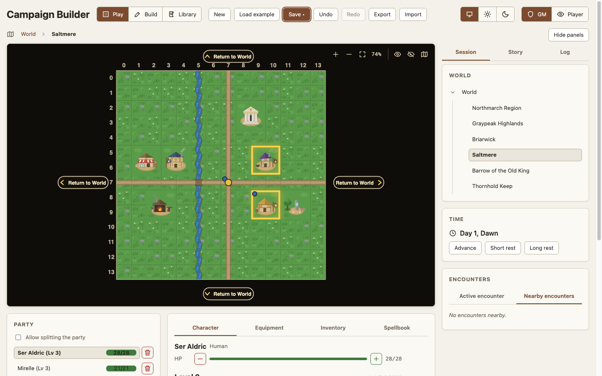
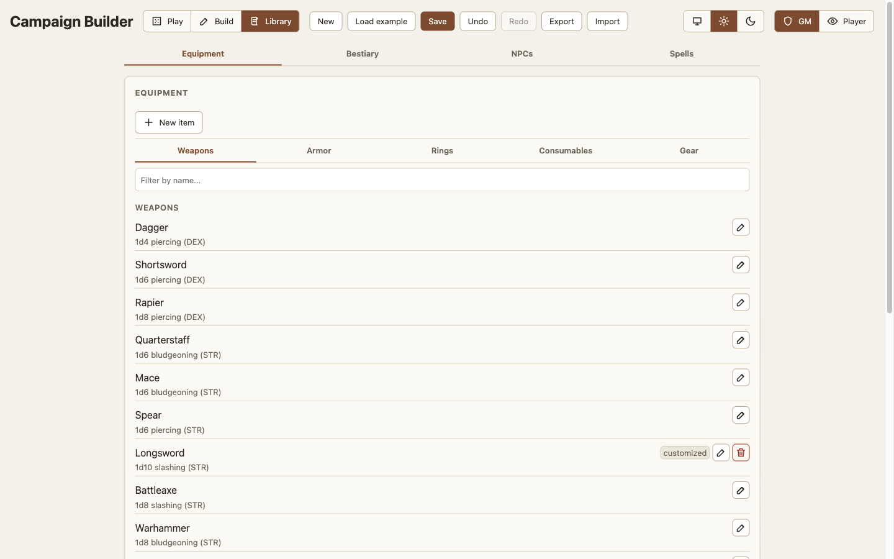

# GM guide

*How-to guide. Each section is one task. For what a control means, read the
[GM reference](gm-reference.md). If you are new, do the
[first session tutorial](tutorial-gm-first-session.md) first.*

Every task below assumes the app is open in a browser. Two switches in the
header decide what you can see: the mode switch and the role switch. If a
control in a task does not show, set the mode that the task names.

## Start a campaign

### Start from nothing

1. Open the app. A first run with no saved campaign gives you one empty
   world map.
2. If a campaign is already loaded, click **New** in the header.
3. Confirm the reset. This replaces the current campaign and its save.

### Start from the example campaign

1. Click **Load example** in the header.
2. Confirm the replacement.
3. Switch to Play mode and move the party to see how the pieces fit.

### Start from a file

1. Click **Import** in the header.
2. Pick a `.json` file that you exported earlier.
3. If the file carries library customizations and you already have your
   own, a prompt asks before it replaces them. Decline to keep yours; the
   campaign imports either way.

## Save and back up

1. Click **Save**, or press Ctrl/Cmd+S. The button reads "Save •" while
   changes are unsaved.
2. Before a large edit, click **Export**. This downloads the whole campaign
   as a `.json` file. Your library customizations ride along in the same
   file, so one export moves both.
3. Keep the exported file. It is the only copy outside this browser.

To step back, click **Undo**. Undo returns to the state before your last
Save, New, Load example, or Import. If you save from a stepped-back
position, the app discards what was left to redo.

## Drive a player-facing display

1. Save in your GM tab. The save reaches the other tabs.
2. Open a second tab on the same address, with `?role=player` on the URL.
3. Put that tab on the display that faces the table.
4. To lock the tab without the URL parameter, click the padlock beside the
   role switch and confirm.

A locked tab hides the role switch and can never show the GM view. To
unlock it, close the tab or remove the URL parameter.

### Let one player run their own character

1. Open a tab with `?role=player&character=<id>` on the URL. You can also
   pick the character from the "Playing as" dropdown in the Party panel.
2. Tell the player what they can do: spend slots and other resources, set
   conditions, and use, give away, or discard carried items.
3. Recover their resources yourself. A player can spend a slot but cannot
   restore one.

Only one tab at a time can play a given character.

## Build a world

Switch to **Build** mode. The world tree sits on the left, the editable map
in the center, and the palette and tile inspector on the right.

### Add a node

1. In the World tree, click the add-child control on the parent node.
2. Give the node a name, a kind (Region or Interior), an environment tag,
   and a size.
3. To resize the node later, use its edit control. Growing keeps the
   existing tiles. Shrinking removes anything outside the new bounds, and
   confirms first when that removes painted tiles.

### Paint tiles

1. Pick a brush in the **Palette**. Click a section heading to expand
   Terrain, Roads, Buildings, or Interior.
2. Left-drag across the map. Every cell the pointer crosses takes the
   brush. A single click paints one cell.
3. To make a landmark dominate its surroundings, set **Size** to 2x or 3x
   before you click. One click then stamps one tile across a 2x2 or 3x3
   block.
4. To clear cells, pick **Erase** and drag.
5. To revert the last edit, click **Undo stroke** or press Ctrl/Cmd+Z. A
   whole drag counts as one edit.

Pan with a right-button drag, and zoom with the wheel. The left button
paints.

### Generate a map instead of painting it

1. Open the **Generate** card in the right rail.
2. Pick an archetype and a size. The dialog previews the exact layout.
3. Click **Reroll** until you like the preview. Nothing changes the node
   until you accept.
4. Write down the seed if you want this layout again.
5. For a dungeon with more than one level, set **Levels**. Each level
   becomes a child node, joined by its stairs.
6. Accept. If the node already holds tiles, the app confirms first.

If nothing on the parent map links to this node, the app places an entrance
tile near the center of the parent and tells you where. Repaint or relink
that tile to move the entrance.

### Mark a point of interest

1. Pick the **Inspect** tool and click the tile.
2. Set the **POI type** in the tile inspector.
3. For a secret, turn on **discoverable**. The POI stays hidden until the
   party steps onto its tile.
4. Write GM-only text in **Notes**. Players never see it. In Play mode you
   see it on hover.

### Set where the party starts

1. Pick the **Inspect** tool and click the tile.
2. Click **Set party start here** in the tile inspector.

### Link a region so the party can zoom in

1. Pick the **Region** tool.
2. Drag a rectangle over the block of tiles.
3. On release, link the block to an existing child node, or create a new
   one. Every tile in the block then leads into that child.

To link one tile instead, use **Zooms into** or **New region here** in the
tile inspector. On an outdoor map this stamps a 2x2 block: the tile plus
its right and lower neighbors, shifted at the map edge. Interiors keep
single-tile links, because a stair or a door is one cell. Unlinking a tile
clears its whole block.

You do not author the way back out. An outdoor sub-region leaves by any
side that touches painted tiles on the map above. An interior leaves
through an outer door, or through the staircase that joins it to the level
above or below.

### Fix a broken link

1. Look for a warning triangle in the World tree, or a warning above the
   tool tabs.
2. If the warning reads "Nothing leads here", link a tile on the parent map
   to this node.
3. If the warning reads "No way out", paint an outer door or a staircase
   for an interior. For an outdoor sub-region, paint a parent tile beside
   its block.

## Run a session

Switch to **Play** mode. The sidebar holds Session, Story, and Log tabs.
Click **Hide panels** to give the map the full width.

### Move the party

1. Click a tile. The whole party moves there, and fog opens around the new
   position.
2. To move with the keyboard, focus the map, move the cursor with the
   arrows, and press Enter or Space.
3. To zoom into a region, click a region-linked tile.

### Split the party

1. Turn on **Allow splitting the party** at the top of the Party panel.
   Every character now stands on the map as their own token.
2. Select a character in the roster. Your clicks now move that character.
3. To reach a map that is not on screen, click the map button on the
   character row, labeled **Place** and their name. Pick any map and tile.
4. To rejoin someone to the party, click the tile of the party.
5. To regroup everyone, turn the switch off. A dialog asks whose position
   the others teleport to.

### Reveal or hide fog by hand

1. Click the reveal-brush eye button on the map, then click or drag across
   tiles.
2. To re-fog tiles, use the hide brush the same way.
3. To open a whole map, use the reveal-area action.

Players never see these controls.

### Leave a sub-region

1. Look at the margin for a **"Return to {parent}"** arrow, or at the map
   for a chevron badge on a door or a staircase.
2. Click the arrow. The party walks out onto the tile it crossed to get
   here.
3. To leave with the keyboard, press into the border twice. The first press
   lights the arrow, and the second walks out.

### Stage an encounter

1. Switch to **Build** mode and open the **Encounters** card in the right
   rail.
2. Click **New encounter**. It defaults onto the selected tile.
3. Set the name, max HP, level, and tier. The tier and level stamp a
   default stat block and default gear.
4. Set the challenge rating, and tick the saving throws and skills the foe is
   trained in. The rating feeds the difficulty hint, and it sets the bonus the
   foe adds to each save and check. Leave the rating at **Unrated** for a foe
   you do not want counted.
5. Change the weapon and the armor if you want. Pick **None** for a beast
   that carries no weapon or wears no armor.
6. To place the encounter elsewhere, set the map and the tile in the same
   dialog.

To edit a staged encounter later, click the pencil on its row. Its current
HP, stat block, and conditions survive the edit.

### Reuse a foe

1. Click the save icon on an encounter row. This stores its blueprint as a
   campaign template.
2. To spawn a copy, click **From bestiary** in the Build rail and pick the
   template or a library entry.
3. The copy arrives at full health on the chosen tile.

A campaign template is a snapshot. Later edits to the live encounter do not
change it.

### Run a fight

1. Move the party onto a tile that holds a live creature. A modal names
   each hostile one. A friendly or neutral creature opens no modal, but it
   still lists in the panel.
2. Open the **Active encounter** tab and click **Start combat**. The tab
   lists every live creature on the tile, and the button shows whenever
   the tab has a row. A party set on fighting a bystander can do so.
   Above the rows, one line rates the fight for you: what the hostile
   creatures are worth against your party's budget. Players never see it.
3. In the setup dialog, click **Roll initiative**, or type values by hand.
   Hostile creatures on the tile join the foes. Friendly and neutral
   creatures join the party. The party can still attack a creature on its
   own side.
4. Start the fight. The combat screen takes the full width.

5. Click a board card to target it. Click it again to release it.
6. Click a weapon in the action bar to attack, or a spell to cast. The
   dialog opens with the target already picked, so Enter rolls it.
7. For a bonus die, a penalty die, or a flat rider, open the **Situational
   modifiers** disclosure in the dialog.
8. Click **Next turn** to advance. Timed conditions tick down each round.
9. When the fight is over, click **End combat**.

Defeating the last enemy does not end the fight. A victory banner appears,
and the fight stays open so that everyone can heal and read the log.

To step away without ending the fight, click **Back to map**. The
**Initiative** card in the sidebar brings you back.

### Adjust a stat for a few rounds

1. Find the encounter row in the Play sidebar.
2. Click a stat chip and set the value and the number of rounds.
3. The chip reads "STR 14->16 (3r)" and ticks down as rounds pass.

### Rule distance yourself

The app does not measure distance between tokens, by design. Movement,
range, reach, and the shape of an area spell are your calls at the table.
Each call has a control that carries it into the rolls.

- **Movement.** The speed badge on the sheet shows the walking speed of a
  character. Narrate who stands where. Move the party token when the group
  changes tiles. The app spends no speed.
- **Long range.** If a shot is past the normal range of the weapon, set
  the Range field in the attack dialog to the long distance. The roll
  takes disadvantage.
- **Cover.** If something stands between the attacker and the target, set
  the "Target cover" select beside the roll mode. Half cover adds 2 to the
  AC of the target, and three-quarters cover adds 5. If the target has
  total cover, do not roll.
- **Reach and opportunity attacks.** Decide who is in reach and say so.
  When a creature leaves the reach of an enemy, use the "Reaction" row on
  the board card of that enemy to make the opportunity attack.
- **Area spells.** The cast dialog lists the reachable combatants, up to
  the target count of the spell. Decide who stands in the area, then pick
  those combatants.
- **Anything else.** Open the **Situational modifiers** disclosure in the
  roll dialog. A bonus die, a penalty die, or a flat rider covers a ruling
  that no control above names.

## Track characters

### Create a character

1. Open the **Party** roster and create a character.
2. Pick a class, a race, and a background, and take the skill choices the
   class offers.
3. Edit any assembled proficiency by hand afterward.

### Spend and restore resources

1. Use the steppers on either side of the HP bar for damage and healing.
2. Click a filled spell-slot pip to spend the slot. Click an empty one to
   restore it.
3. To heal on a short rest, spend a hit die from the Progression block.

### Level a character

1. Click **Award XP** in the Party roster to grant XP to everyone at once.
2. Open the Progression block. Each earned level waits as a pending level.
3. Assign the level to the current class, or to a new class to multiclass.
4. If the level is an ASI level, apply +2 across one or two abilities, or
   take a feat by name.
5. To undo either choice, use the same block.

### Equip and carry items

1. Add the item from the form below the Inventory list. Set its type,
   description, and any damage roll, AC bonus, or ability buff.
2. To fill a standard weapon or armor, use the **5e preset** picker, then
   adjust the values.
3. Open the **Equipment** tab and pick the item in its slot.
4. To edit an item later, click the pencil on its row.

Only a GM adds an item. A player uses, gives away, and discards what the
character carries.

### Rest

1. Open the **Time** panel.
2. Click **Short rest** to restore half of the character resources, or
   **Long rest** to restore all of them.
3. For spell slots, take a long rest. A short rest leaves them spent.

## Write the story

### Add an NPC

1. Open the **Story** tab and add an NPC.
2. Set the disposition, the notes, and the placement.
3. To place the NPC, pick a map and tile coordinates. Leave it unplaced to
   make it appear everywhere.
4. An NPC is a combatant, so it has hit points, a stat block, and gear. A new
   one is a commoner: 4 HP, no weapon, and no armor. Arm the ones that fight,
   and give a tough one more HP.

### Reveal a handout

1. Open the **Handouts** panel and add the read-aloud text.
2. Attach it to the current node or to the whole campaign, and add an image
   if you want one.
3. When the moment arrives, click the eye toggle. Players see only revealed
   handouts.

### Track a quest

1. Open the **Quests** panel and add the quest.
2. When the party finishes it, click the toggle. The plus becomes a
   checkmark.

## Curate the library

Switch to **Library** mode. It has Equipment, Creatures, and Spells tabs.
The Creatures tab splits into Foes and People subtabs by disposition.

### Change a built-in default

1. Find the entry and edit it.
2. The row gains a "customized" badge. The default is not deleted.
3. To restore the default, click the revert button on the row.

### Add your own entry

1. Click the add control on the tab.
2. To override a default, give the entry the same name. For equipment, the
   name and the type must both match.
3. Anything else is added beside the defaults.

### Add a spell the app does not ship

The built-in list holds 30 spells. A GM-authored spell uses the same schema
as a built-in one, so no code change is needed. See
[Curated spells](spells-missing.md) for what the resolver can and cannot
apply.

1. Open the **Spells** tab in Library mode and create the spell.
2. Pick the effect kind: attack, save, heal, or utility. Set the scaling by
   slot level, or by caster level for a cantrip.
3. If the rules of the spell need more than the app models, create it as a
   `utility` entry and write the rules in the description. Then adjudicate
   it by hand.

### Move your library between browsers

1. Click **Export** in the Library file card. It downloads
   `campaign-library.json`.
2. Save that file over `library/campaign-library.json` in the project
   directory. A fresh browser or a fresh clone loads it at startup.
3. To load a file into the current browser instead, click **Import** and
   confirm.
4. To drop every customization, click **Reset**. Export a copy first if you
   want to keep one.

A campaign export carries your library too, so importing a campaign file
in the other browser moves both at once. Use the Library file card when
you want the library without a campaign.

## Export the map as an image

1. Switch to **Build** mode and open the map you want.
2. Click **Export PNG** in the Tools card.

The download is full resolution and ignores fog. Use it for printing or in
a virtual tabletop.

