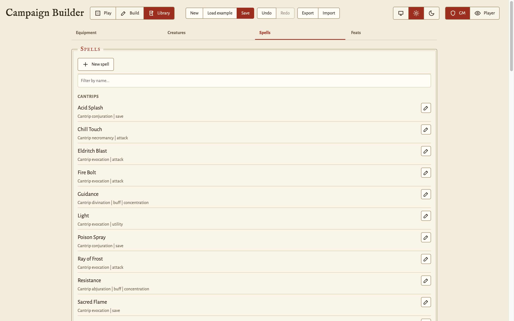

# GM guide

A practical guide to Campaign Builder for the GM. It assumes no familiarity
with the code. See [`architecture.md`](architecture.md) for that.

If a control named here does not show, first look at the **mode** and
**role** switches in the header. Most of the app depends on these two
settings.

## Starting out

Run the app in a browser over HTTP. See the README for the dev server.

On a first run with no saved campaign, you start from a **blank campaign**:
one empty world map, no characters, and no encounters.

From there you have three starting points:

- **New** (header): a confirmed reset back to the blank campaign. This
  replaces the current campaign and its save. The app asks you to confirm
  first.
- **Load example**: replaces the current campaign with a complete demo
  campaign. It has a 32x32 overworld with a bay coastline and hand-shaped
  terrain. Four outdoor subregions sit on it: two wilderness regions, the
  farming town of Briarwick, and the port of Saltmere. It also has a
  dungeon interior and a castle keep, populated end to end as a playable
  arc. It ships all of this:

  - An eleven-quest chain: goblin raids that trace back to the risen king
    in the barrow, with side threads through the port, the keep, the mine,
    and the wardstones.
  - Two staffed towns of NPCs.
  - Field enemies in every biome.
  - Minor bosses and a major boss.
  - Lore handouts.
  - A bestiary of reusable mob templates.
  - A two-member party with kit and spell slots.

  Use it to see how a filled-in campaign looks before you build your own.
  It also overwrites the current campaign, so it confirms first.
- **Import**: load a campaign from a `.json` file that you exported
  earlier.

The app does not save automatically. Click **Save** to write the campaign
to the browser's local storage. **Export** downloads the whole campaign as
a `.json` file. Use this file to back up the campaign or move it to
another machine.

**Undo** steps back to the state before your last Save, New, Load example,
or Import. **Redo** steps forward again. Both controls grey out when there
is nothing left in that direction. The history covers many steps, but not
an unlimited number. If you save from a stepped-back position, the app
discards anything you had left to redo.

Everything lives in one browser's local storage, under a single origin.
There is no server and no account.

## Modes and roles

Two independent switches in the header change what you see.

- **Mode: Play, Build, or Library.** Build mode is for authoring the world:
  drawing maps, placing points of interest, and defining regions. Play mode
  is for running a session: moving the party, revealing fog, and tracking
  encounters. You build in Build mode, then switch to Play mode at the
  table. Library mode is a map-less view for curating the reusable
  collection of templates (equipment, bestiary enemies, NPC archetypes)
  that feeds the preset pickers everywhere else. See "The library" below.
- **Role: GM or Player.** The GM sees everything: exact enemy HP, secret
  tile notes, and the full map. A player sees a safe subset: enemy health
  as a coarse band (Unharmed, Bloodied, or Down, not exact numbers), no
  secret notes, and only the fog-revealed map. Player role is read-only. It
  forces Play mode and hides the authoring and campaign-management
  controls.

Role is set **per browser tab**. You can open a second tab, set it to
Player, and put it on a display that faces the table. Only one tab at a
time can hold the GM view. While a GM tab is open, every other tab of the
same origin opens as the Player view, and stays in it. Closing the GM tab
frees the role for another tab to claim. If the GM tab crashes instead of
closing, the claim expires on its own after a few seconds.

Every save in your GM tab, including autosaves, reaches the other tabs.
This is how you drive a player-facing screen from your laptop without a
server. A Play-mode tab takes the change without a reload, so the display
keeps its scroll position, its open panel, and the zoom and pan you left
the map at. The two tabs share one campaign. The role is the only thing
that differs between them.

A Player tab still shows the GM/Player switch. If your GM tab closes, the
switch immediately claims the GM view. To lock it, do one of the
following:

- Open the tab with `?role=player` on the URL. This works well for a
  bookmark.
- Click the padlock next to the role switch while in the Player view,
  then confirm.

A locked tab hides the switch entirely and can never show the GM view. To
unlock it, close the tab, or remove `?role=player` from the URL.

Independent of mode and role, the **theme switch** at the right of the
header (monitor, sun, or moon) sets the whole UI to a light or dark
scheme. The default, System, follows the operating system's preference.
The app saves the choice per browser, so a dark GM laptop and a light
table display can coexist.

A Player tab can also **play as one character**. Pick one from the
"Playing as" dropdown at the top of the Party panel, or open the tab with
`?character=<id>` on the URL. Combine `?role=player&character=hero` for a
bookmarked per-player display.

A bound tab can play its character: spend spell slots and other
resources, add and clear conditions, and use, give away, or discard what
the character carries. A bound tab cannot edit base attributes (stats, XP,
Bonus HP, Base AC), add an inventory item, or touch any other character.
An unbound Player tab is a pure spectator.

Recovery of a resource stays the GM's job. A player can spend a slot but
cannot put one back. A spent pip on a Player tab reads as spent, and is
not clickable. HP steppers are GM-only for the same reason.

Bindings are exclusive. Only one tab at a time can play a given
character, under the same claim-and-expire rules as the GM view, so two
tabs can never both act as the same hero. The GM tab ignores bindings
entirely, and can always edit everyone. Dice rolled from a bound tab are
logged in the travelogue under the character's name ("Hero rolls
d20..."). A spectator tab's rolls stay anonymous ("A player rolls...").

## Building a world (Build mode)

Switch to **Build** mode. The layout changes to a world-tree rail on the
left, the editable map in the center, and a palette and tile inspector on
the right.

### Nodes and the world tree

The world is a tree of **nodes**. The top node is your world map. Regions
and interiors hang beneath it. The **World tree** (left rail) always shows
this hierarchy: every node, and where you are in it. Add, rename, resize,
and delete nodes from the World tree.

A node has a **kind**:

- **Region**: an outdoor or overworld area. It gets the full terrain and
  road palette.
- **Interior**: a building or dungeon. It gets only the interior pieces
  (floors, walls, doors, stairs).

Each node also carries a free-text **environment** tag, for example
grassland, forest, shop, or temple. Use it for description and flavor.

To create a node, use the world tree's add-child control. A dialog asks
for the name, kind, environment, and size. To resize a node later, use its
edit control. Growing a node keeps its existing tiles. Shrinking a node
removes anything outside the new bounds, and asks for confirmation first
if that removes non-empty tiles.

### Painting tiles

Pick a brush in the **Palette** (right rail). **Left-drag** across the map
to paint every cell that the pointer crosses. A single click paints one
cell. Swatches are grouped into collapsible **Terrain**, **Roads**,
**Buildings**, and **Interior** sections. Click a heading to expand or
collapse it. The palette is filtered to the node's kind, so an interior
only offers interior pieces.

The **Size** row (1x, 2x, or 3x) sets how large the next painted tile's
art draws. At 2x or 3x, a click stamps one tile whose image stretches
across a 2x2 or 3x3 block. This suits landmarks, for example an academy or
a keep, meant to dominate their surroundings, with no sub-region link
involved. The block is purely visual. The covered cells keep their own
terrain, roads across it stay tile-sized, and fog reveals it piecewise. If
you re-paint the anchor cell at 1x, the art shrinks back to one cell. A
scaled stamp places one block per click, and a drag does not repeat it.
Roads always paint at 1x.

Tools in the palette:

- **Brush**: the selected terrain, road, or marker.
- **Erase**: clears cells back to empty.
- **Inspect**: selects a single cell to edit in the tile inspector.
- **Region**: drag a rectangle to mark a block of tiles as one sub-region
  (see below).

**Roads overlay** the terrain beneath them. You can run a road across
sand, snow, or grass, and the ground still shows through the verges. If
you re-paint the terrain under a road, the road stays on top.

Pan the map with the **right mouse button** in both modes: drag with the
right button held. The wheel zooms. The left button is reserved for
painting in Build mode and for acting in Play mode.

**Undo stroke** (the Tools card, or Ctrl/Cmd+Z in Build mode) reverts the
last edit. A whole paint or erase drag counts as one edit. A region link
or a generation also counts as one edit each. This history is separate
from the header's save-level Undo and Redo, and lasts only until the page
reloads.

The Tools card also has **Export PNG**. It downloads the current map as a
full-resolution image, with fog ignored, for printing or for use in a
VTT.

### Generating a map

Instead of painting a large map tile by tile, use the **Generate** card
(right rail) to fill the current node with an automatically generated
layout. Pick an archetype: **wilderness** or **town** for a region,
**dungeon** or **castle** for an interior. Then pick a size: small,
medium, or large.

The dialog shows a **live preview** of the exact layout it will stamp,
driven by a visible **seed**. Click **Reroll**, or change any field, to
see a different candidate. Nothing touches the node until you accept, so
a reroll costs nothing. The seed reproduces the layout, so write it down
if you want to regenerate the same map later. Accepting replaces the
node's grid, and asks for confirmation first if the node already has
tiles.

Every generated layout can reach its parent map. A dungeon gets an
entrance corridor with a door on the map edge. A castle gets a gate in
the south wall. A town gets roads that run edge to edge.

Generating also guarantees a way in from the map above. If nothing on the
parent map links to the node yet, the app places an entrance tile (a
dungeon, castle, or settlement marker that matches the archetype) near
the center of the parent, and an alert tells you where. Repaint or relink
that tile to move the entrance where you want it.

Dungeons can have multiple levels. Set **Levels** to more than one, and
each level's stairs-down leads to a freshly generated level below it,
created as a child node in the world tree. When the party goes down the
stairs, it lands on the lower level's stairs-up. The bottom level has no
stairs-down.

### Points of interest and tile metadata

Select the **Inspect** tool, then click a tile to open the **Tile
inspector**. There you set the tile's **POI type**, a **discoverable**
flag, and free-text **notes**.

- **Notes** are GM-only. Players never see them. In Play mode (GM role),
  you see them on hover.
- A **discoverable** POI stays hidden (no gold outline, no tooltip) until
  the party steps onto its tile. At that point, the app marks it
  discovered, and it stays that way. Use this for secrets that the party
  must not see coming.
- The inspector also has **Set party start here**, which places the
  party's spawn tile. The app saves the party position, so this tile is
  effectively the campaign's start point.

### Regions (zoom-in areas)

A **region link** makes a block of overworld tiles zoom into a child node.
Select the **Region** tool, drag a rectangle over the block, then link it
to an existing child node, or create a new one, on release. Every tile in
the block then shares that child, so clicking anywhere in the block (in
Play mode) zooms in.

To link a single tile, use the tile inspector's **Zooms into** select or
**New region here** control. On outdoor maps, this stamps a 2x2 block: the
selected tile plus its right and below neighbors, shifted at the map edge.
A sub-region always has a visible footprint this way. The app leaves
alone any neighbors already linked elsewhere, walls, and empty cells.
Interiors keep single-tile links, since a stair or door is one cell.
Unlinking a tile clears its whole block.

On outdoor maps, a linked block also draws as enlarged art rather than
repeated tiles. Each 2x2 chunk of the block shows one image scaled across
it. A bigger block gets several distinct 2x2 images, never one image
stretched further, so a region entrance reads as a landmark. Roads and
paths laid through the block stay tile-sized on top of it. Fog still
reveals the block piecewise, and interiors draw tile by tile as usual.

When the party zooms into a region, it lands on a border tile chosen from
the direction of approach, rather than a fully fogged interior.

The way back out follows the same links, so you do not author it
separately. An outdoor sub-region can be walked off any side that touches
painted tiles on the map above. An interior leaves through a door on its
outer wall, or through the staircase that connects it to the level above
or below. If you link a child from a stairs-down tile, the child leaves
by its stairs up. If you link a child from a stairs-up tile (a keep's
upper story), the child leaves by its stairs down.

Build mode warns you above the tool tabs when the node in view has no
way in or out:

- **"Nothing leads here"** means no tile on the parent map links to this
  node at all, so the party can never reach it.
- **"No way out"** means the node is linked, but has nothing to leave
  through. For an interior, this means no outer door or usable
  staircase. For an outdoor sub-region, this means no painted tile on
  the parent map beside its block to walk out onto.

The world tree marks every node with a problem with a small warning
triangle. Hover it to read the sentence. This way, a broken link shows up
immediately, wherever you are looking. None of these problems strand a
party in Play: a node without an authored way out still offers a plain
"Return to {parent}" button. They flag an unfinished map instead.

## The library (Library mode)

The third header mode opens the **library**: a map-less, GM-only view of
the reusable templates that feed the preset pickers everywhere else. It
has four tabs.

- **Equipment**: every weapon, armor, gear item, and consumable that the
  item form's preset picker offers. These are the 5e defaults built into
  the app, all listed, split across category subtabs (Weapons, Armor,
  Rings, Consumables, Gear), with type headings inside the multi-type
  categories.
- **Bestiary**: the built-in stock enemies (goblin, wolf, bandit, skeleton,
  orc, ogre) that the Build rail's From bestiary picker offers, alongside
  your campaign's own saved templates.
- **NPCs**: stock townsfolk archetypes (innkeeper, guard, merchant, elder,
  cultist). The hand-off icon on a row opens the normal New NPC dialog,
  pre-filled from the template, so you can add one to the campaign and
  place it in one step.
- **Spells**: the spell catalog that a character's spellbook picks from,
  grouped by spell level. Each entry shows its school and effect kind
  (attack, save, or utility) under its name, and marks concentration where
  it applies.

Every entry is editable. If you edit a **built-in default**, the app does
not delete it. Instead, it stores an *override* in your custom library:
the row gains a "customized" badge, and a revert button restores the
default. New entries that you add carry a "custom" badge and a delete
button. A custom entry overrides a default when the names match (for
equipment, the name and type must match). Anything else is added
alongside the defaults. Filter boxes narrow each list by name.

Customizations live outside the campaign. New, Import, and Load example
replace the campaign, but never touch the library, so a tuned equipment
list follows you into every world you build. The browser stores these
customizations, and the **Library file** card round-trips them through a
portable JSON file:

- **Export** downloads `campaign-library.json`. Save it over
  `library/campaign-library.json` in the project directory, which ships as
  an empty library. A fresh browser, or a fresh clone, auto-loads it at
  startup. Git tracks this one file, so your customizations show up as a
  change to it. Commit it if you want the library to travel with the
  repo, or leave it uncommitted if you do not.
- **Import** hot-loads any exported library file into the current browser,
  and replaces your customizations after you confirm.
- **Reset** removes all customizations, and restores the pure built-in
  defaults. Export a copy first if you want to keep one.

The merged lists apply immediately. The item form's preset picker, the
encounter dialog's weapon and armor selects, and From bestiary all read
the library live, so an overridden Longsword or a homebrew monster shows
up the next time any of those open.

## Running a session (Play mode)

Switch to **Play** mode. The map is the primary element. A sidebar holds
the session panels in three tabs: **Session** (world, time, encounters,
initiative), **Story** (quests, NPCs, handouts), and **Log** (the
travelogue). Click **Hide panels** to collapse the sidebar and give the
map the full width.

### Moving the party and fog of war

By default, the party moves as one marker. As GM, click a tile to move
the whole party there. You can also use the keyboard cursor: arrows move
the cursor, and Enter or Space acts. Moving reveals fog in a radius
around the new position, and revealed tiles stay revealed. Clicking a
region-linked tile zooms into that region. As GM, this moves the party
in. In a player tab, it only brings the region into view.

The GM-only **Allow splitting the party** switch, at the top of the
Party panel, controls whether the party can split up. It is off by
default. While it is off, only the shared party marker draws (no
per-character tokens or name labels), and everyone travels together with
the GM's clicks. A player tab's map clicks move no one.

With the switch on, every character stands on the map as their own gold
token, with their name above it. Characters travelling together share a
tile, and their names stack. Your clicks now move one character:
whoever is selected in the Party roster. That character's step reveals
fog around them. Clicking the party's tile rejoins them to it, and
clicking a region-linked tile walks them into that region.

To move someone else, select them in the roster first. Picking a
character jumps the map to whatever region they stand in, and centers it
on their tile, so a scattered party is one click away. In a player tab
bound to a character (see "Player tabs play one character" above), a
click moves that player's own character the same way. A spectator tab
moves no one.

You can also place one character from the roster, using the map button
on their row, labeled **Place** plus their name. Choose any map and
tile, or choose "With the party" to go back. Use this to reach a map
that is not on screen. If a character steps onto an encounter's tile,
the encounter alert appears under that character's own name.

If you turn the switch off while characters stand apart, the party
regroups first. A dialog asks which member's position everyone
teleports to. Then all characters gather there, and simultaneous
movement resumes. If you cancel the dialog, the switch stays on and
nobody moves.

Once the party is inside a sub-region, the ways back out are drawn on
the map. An outdoor region shows a **"Return to {parent}"** arrow in the
margin beside each side that leads back onto the map above. Click it,
and the party walks out onto the tile they crossed to get here. The
cursor keys take the same exit in two presses into that border: the
first press lights the arrow up, and the second press walks out. This
way, a held key never carries the party off the map by accident.

An interior marks its outer door and its connecting staircase with a
small chevron badge instead, pointing up or down to match the direction
the stairs run. These are ordinary tiles as well, so they only lead out
once whoever you are moving already stands on them. A first click just
walks into the doorway. The arrows track the party along the side they
lead off, and pin to the edge of the viewport when you pan the map's
border out of view.

Regions on the overworld do not highlight until at least one of their
tiles is revealed.

The map grid is labeled with X/Y coordinates along the top and left
edges, so you can call out tile positions. When you zoom or pan far
enough that the grid edge leaves the viewport, the labels pin to the top
and left edges of the map viewer, at partial opacity, so coordinates
stay readable without hiding the map under them.

As GM, you also get direct fog control, using the eye buttons on the
map: a **reveal brush** and a **hide brush** (click or drag across tiles
to light or re-fog them), plus a **reveal whole area** action for the
current map. Players never see these controls.

### Encounters

Build an encounter roster in the Build rail's **Encounters** tab. Set the
name, max HP, level, and a **tier**: a rank-and-file *mob* or an
above-normal *legend*. Then bind each encounter to a tile.

The tier and level stamp a default stat block. The six ability scores,
plus AC, are the only stats an enemy carries, and a legend always
out-stats a level-matched mob. The tier and level also arm the enemy with
generic **gear**: a weapon from the library's weapon list, and a named
armor whose flat AC bonus adds on top of the stat block's base AC. Both
pickers also offer **None**, for a non-bipedal beast, an ooze, or
anything that carries no weapon or wears no armor. This leaves the enemy
unarmed (no attack button in combat) or unarmored, with no default gear
stamped back in. Both stay editable in the same create-or-edit dialog,
and the Build rail's Encounters tab shows each enemy's gear under its
name. Bestiary templates carry gear along with the stat block.

In Play mode, the sidebar's Encounters panel splits into two tabs:

- **Active encounter** lists the live encounters on the party's tile,
  that is, what the party has walked into, and carries the **Start
  combat** button. Stepping onto such a tile switches to it, and leaving
  switches back.
- **Nearby encounters** lists the rest in range: within four times the
  fog reveal radius of the party's tile.

Authoring (New encounter, From bestiary) lives in Build mode's rail, not
the Play sidebar. Both tabs are always present and you can select either
freely. An empty tab says so. Players see fewer encounters: a nearby
encounter enters their sidebar only once it is discovered, that is, once
its tile is revealed through the fog, or, for an unplaced one, once the
party has walked into it.

When the party **steps onto a tile with an encounter**, a modal pops up
over the map, naming the encounter, its region, and its coordinates. If
the party flees or ignores an encounter, it stays in the sidebar for
that node. The app does not remove it. A live encounter's tile shows a
red diamond marker once the party, or a split-off character, comes
within detection range (twice the fog reveal radius). You see a live
encounter's marker slightly before its tile is revealed. Anything
further stays hidden.

Every encounter row has an **edit** (pencil) action that opens the same
dialog the add flow uses (name, HP, level and tier, and the map and tile
placement), so you can move an encounter without deleting and
recreating it. Its live state survives an edit: current HP carries over
(clamped if you lower the max), and the stat block and conditions stay
as you tuned them.

Build mode has its own **Encounters** card in the right rail, scoped to
whatever map you are looking at, with the same edit and delete actions,
plus a New encounter button that defaults onto the selected tile. Use
this to stage a region's fights while authoring it, without walking the
party there. This card is also where you **edit base stats**: every row
carries the full set of stat chips, and clicking one sets its value.
Clicking a placed encounter's name **focuses the map** on its tile, so
you can find a staged fight without hunting for coordinates.

Damage and heal an encounter from the panel. A defeated encounter is
styled as such, rather than deleted, so you keep a record of what died.
Each encounter row tracks its own status **conditions** (poisoned,
prone, and others) and shows its **stat block** as chips, for example
"AC 13", GM-only. In Play mode, the chips are not for editing base
values. Clicking one applies a **timed adjustment**, for example +2 STR
for 3 rounds, shown as "STR 14->16 (3r)" and ticked down automatically
as combat rounds pass. Combat math (initiative's DEX modifier) uses the
adjusted values while they last.

Put recurring foes in the **bestiary**. The save icon on an encounter
row stores its blueprint (name, max HP, stat block, gear) as a campaign
template. The Build rail's **From bestiary** button spawns a fresh,
full-health copy at a chosen tile, defaulting to the selected one, so a
repeat foe is one click. The picker lists your campaign's saved
templates alongside the **library** bestiary (the built-in stock
enemies, plus anything you added in Library mode), labeled by origin.
Campaign templates are snapshots: later edits to the live encounter do
not change them, and the same dialog can delete a stale one. You manage
library entries in the Library tab instead.

### Combat (the fight screen)

Opening combat is a GM-only action. While the party stands on a tile with
at least one live encounter, the GM's Active encounter tab shows a
**Start combat** button. This opens a setup dialog that lists exactly who
is involved: the party, that tile's encounters, and any NPCs placed on
the same tile. Hostile NPCs line up as foes. Friendly and neutral NPCs
line up with the party.

Each combatant's **DEX modifier** (`floor((DEX - 10) / 2)`, so a DEX of
20 gives +5) shows beside their name, and this value is used everywhere:
the default initiative value is 10 plus the modifier, and **Roll
initiative** rolls d20 plus the modifier for everyone at once. You can
still adjust any value before you start. Players never see the button or
the dialog. They cannot open a fight or roll the party's initiative.

Starting the fight switches the whole view to the **combat screen**. The
map and its panels step aside, and the fight takes the full width.

- The left column details the **active combatant**, that is, whoever is
  taking a turn: initiative, AC, HP, condition chips, concentration with its
  Drop control, and a damage-and-heal pair for quick GM adjustments
  (resistances, temporary HP rulings, undoing a roll). Under this sits
  the combatant's **loadout**: the armor they wear, each weapon with its
  damage roll, how many cantrips and spells they have, and a chip per
  spell-slot pool.
- The center is the **board**: the two sides show as cards with each
  combatant's HP bar, AC, conditions, and a shorter form of the same
  loadout, so picking a target does not require opening a sheet to see
  what it swings. A player's own card shows their spells and slots.
  Another player's card shows armor and weapons only. A foe's card shows
  no loadout at all until the GM's tab looks at it.
- The right column keeps the **combat log** (the travelogue's combat and
  roll entries, newest first), with the **dice tray** docked beneath it,
  so every roll happens in view. Both return to their usual places when
  the fight ends.
- Across the bottom runs the **turn ribbon**: one chip per combatant in
  initiative order, the current turn ringed, foes marked with a sword,
  and defeated combatants struck through. Clicking a chip inspects that
  combatant in the left column without advancing the turn.

The ribbon's **Back to map** leaves the screen without ending the fight.
The sidebar's **Initiative** card is the way back: it shows the round,
whose turn it is, and an **Open combat** button.

Step through the fight with **Next turn**. The round counter advances,
and on each new round, timed conditions tick down and expire on their
own. Defeating the last enemy does not end the fight. A banner appears
over the board that says the party is victorious, and the fight stays
open, so everyone can heal, read the log, and take another round if they
want one. **End combat** closes the fight and returns to Play, and only
the GM can click it. A fight also ends on its own if the party walks off
the tile, or if you delete the last encounter staged there.

Acting takes two clicks. Click a board card to target it, and click
again to release it. Then pick from the **action bar** under the active
combatant: their weapons as attack buttons (a party member's equipped
weapons, or a foe's assigned weapon), then a caster's castable spells as
cast buttons, grouped by spell level under the same headings the
spellbook uses. The attack dialog opens with your targeted defender
already picked, so a plain Enter rolls it. Situational overrides (bonus
or penalty dice from Bless or Bane, smite dice, flat riders) sit behind
a **Situational modifiers** disclosure when you need them. A cast dialog
pre-fills its target the same way, whichever shape the spell uses: a
single pick, a multi-target list, or a projectile allocation grid.

The roll itself follows 5e rules unchanged: 1d20, plus the weapon's
ability modifier (STR for melee, DEX for finesse and ranged), plus the
attacker's level-based **proficiency bonus**, against the defender's AC,
rolled in the docked tray. A **natural 20** hits regardless of AC and is
a **critical hit**: every damage die rolls twice. A **natural 1** always
misses. On a hit, the weapon's damage dice also roll, with the ability
modifier folded into the base term (proficiency never adds to damage).
The total lands in the combat log and a toast, by damage type (for
example "12 slashing + 3 fire"), along with any status effects the
weapon inflicts.

The app **applies damage to the defender automatically**. An encounter's
HP drops on the spot, and the app logs a defeat. A character hit by a
foe loses bonus HP first, then real HP, with a log line when the
character drops to 0. NPCs carry no HP, so a hit on one stays a log line
only.

A player tab sees the same screen, with coarse HP bands instead of
numbers (except for their own character, whose exact HP their sheet
already shows), no HP editing, and no End combat. On a tab bound to a
character, that player runs their own turn: the action bar offers their
weapons and spells when their turn comes up, and **End my turn** passes
the turn on. A player tab follows the party into the fight on its own.
Back to map lets a player step out, and the sidebar card's Open combat
button lets them return.

### Characters, HP, and resources

Build the party in the **Party** roster: create, select, or delete a
character. Selecting a character scopes the **Character sheet** and
**Inventory** to that character. Each character has its own inventory.

By default, the character card collapses to the name and race, with a
full-width HP bar and, for spellcasters, a **spell slots** line: one pip
group per spell level, where a filled pip is a slot still unspent. Both
lines are live controls, even without expanding the card. The HP bar
carries **damage-and-heal steppers** on either side, and each slot **pip
is clickable**: a filled pip spends that slot, and an empty one restores
it. Expand the card for stats, the XP award control, and any custom
resource pools. Each ability score shows its derived modifier beside it
(DEX 20 is +5), the same modifier that initiative uses. NPCs carry the
six scores too, editable in their dialogs.

Creation picks a **class** (with a **subclass**, where the class grants
one by the character's level), a **race**, and a **background**, and
offers the class's **skill choices**. From these three choices, the
sheet assembles the character's **proficiencies**: saving throws,
skills, weapons, armor, tools, and languages. Every list stays
hand-editable afterward. The class fixes the **hit die** and caster
type. Max HP derives from that hit die, plus the CON modifier per level,
and a caster's spell slots follow the 5e table (a multiclass character
combines its casting classes on the combined-caster-level table). A
**classless** character still works: HP then falls back to a flat N x
100 growth curve, and the character gains no proficiencies.

Expand the card for the **Progression** block, which lists each class
with its level and subclass, the **hit-dice pool**, and the **class
features** unlocked by level. The hit-dice pool is a spendable resource:
spend a die on a short rest to heal the roll plus the CON modifier, and
a long rest restores half the pool.

Gaining enough XP does not level a classed character on its own. Each
earned level waits as a **pending level** that you assign to a class,
either the character's current class or an eligible new class to
multiclass into. Assigning a level grows HP by that class's hit die,
adds a hit die, and advances spell slots. Newly unlocked spell levels
arrive at full, and already-spent slots stay spent. Crossing a class's
**ASI level** leaves a pending **ability score improvement or feat**:
apply +2 across one or two abilities (capped at 20), or take a feat by
name. Both choices are undoable from the same block.

A consumable gets a **use one** control down to its last charge.
Anything else gets a **drop one** control, but only while it is stacked,
because letting go of the single sword you carry is what the discard
button is for. Both controls sit apart from that discard button, which
takes the whole stack and asks for confirmation first when there is more
than one item. Inventory changes write themselves into the travelogue. A
pickup records who found what, where, and at what in-game time. Using
or discarding an item logs a shorter line.

The panel splits into two tabs.

- **Equipment** (the default) holds nine **equipment slots**: Helmet,
  Armor, Gloves, Greaves, Main hand, Off hand, Ranged, and two ring
  slots (Ring 1 and Ring 2, so a character can wear two rings at once).
  Each picker lists only the items that its slot accepts. A potion
  cannot be worn as armor, and the off hand takes a shield or a weapon.
- The **Inventory** tab holds the item list, with a **search box** that
  matches names and descriptions, and a **type filter**. Items run in
  name order under one **collapsible heading per item type**, showing
  how many of each the character carries, so a long list folds down to
  the part you are looking at. A heading that you fold away stays
  folded while you work.

Only a GM can **add** an item. The add form sits below the list on a
GM's screen, and is absent from a Player tab, because what the party
found is a ruling, not something a player writes for themselves. A
player still uses, gives away, and discards what they carry.

Items carry a **type** (gear, weapon, armor, helmet, gloves, greaves,
shield, bow, ring, or consumable) and an optional **description**, both
set when you add the item. Every field stays **editable afterward**,
using the pencil button on the item's row, which opens the same form
pre-filled. Edits keep the item equipped, since it is the same item,
except that changing its type to something its slot cannot hold takes
it off automatically.

Weapons and bows carry a **damage roll** as structured dice terms: a
base roll plus optional permanent riders, so a burning blade can deal
2d6 slashing plus 1d4 fire. A **5e preset** picker fills standard values
(a greatsword is 2d6 slashing, melee), and the GM can then adjust these
freely. The weapon's **handling** alone fixes which ability modifies its
damage: **melee** uses STR, and **finesse** and **ranged** use DEX. The
summary line shows the full roll with its ability, for example "2d6
slashing + 1d4 fire (STR)". Weapons can also list **status effects**
that they inflict, for example burning or poisoned, added as tags on
the form.

Armor class follows 5e rules. Body armor (the **armor** type, worn in
the Armor slot) is created with a **weight class** and a configurable
**base AC** that replaces the unarmored baseline. The weight class alone
fixes how DEX scales it: **light** adds the full DEX modifier, **medium**
caps it at +2, and **heavy** ignores DEX entirely. This is not
overridable per item. **Shields** always grant a flat +2. Other
equippables (helmets, rings, bows, weapons, and others) can carry a flat
**AC bonus**, an **ability-score buff** (for example +2 STR), or both,
set when you add the item and applied only while equipped. A buffed
score shows the boost beside its modifier on the sheet, and the modifier
reflects the buffed total. Unarmored characters use their **Base AC** (a
GM-only sheet field, normally 10) plus full DEX, so effects like Mage
Armor become a one-field change. The derived **AC readout** in the
sheet's header sums all of this. Removing the last of a stack unequips
it automatically, and saves from the flat-bonus armor era migrate on
load: old body armor reads as light armor with the same total.

The sheet also carries two HP controls beyond the bar's steppers, both
GM-only. **Max HP** overrides the pool's maximum per character, clamping
current HP down if needed. **Bonus HP** tracks temporary points from
items or boons, on top of intrinsic HP. It shows as a "+N" beside the
bar, drains before real HP when damage lands, and healing never refills
it: new bonus HP must be granted.

For combat speed, the Party roster's **Award XP** grants the same
amount to every character at once.

### Time and rests

The **Time** panel tracks the in-game day and watch. **Advance** moves
time forward. **Short rest** and **Long rest** restore character
resources (half or full) and log the rest. Spell slots follow the D&D
rule: only a long rest refills them, and a short rest leaves them spent.

### NPCs, quests, handouts, and the travelogue

- **NPCs**: friendly, neutral, or hostile non-combatants with a
  disposition badge, notes, and a location. The add-or-edit dialog places
  an NPC on any map (region or interior) at specific tile coordinates, or
  leaves it unplaced, in which case it appears everywhere. Each row shows
  the placement, and the panel shows the NPCs at the party's current
  location. Once the party comes within detection range (the same
  twice-the-reveal-radius rule as encounter markers), a placed NPC also
  shows on the map as a blue circle in its tile's upper-left corner (the
  encounter diamond sits upper-right, so a tile can carry both). Hovering
  the tile in Play mode names everyone standing there.
- **Quests**: an active-and-completed quest log. Completing a quest turns
  its toggle button's plus into a checkmark.
- **Handouts**: read-aloud text or lore attached to a node, or to the
  whole campaign, optionally with an attached image shown above the text
  once revealed. Each has an eye toggle that reveals or hides it. A
  revealed handout shows its read-aloud block, so the panel doubles as
  your "read this now" surface. Players (Player role) see only revealed
  handouts, and only read them.
- **Travelogue**: an automatic event log for region entry, teleports,
  encounter defeats, rests, and discoveries. It lists newest first, and
  Clear asks for confirmation.

### Dice

The **Dice Tray** collapses to a single d20 icon. Expand it for the full
tray. Set counts per die type (d4 to d100) and a flat modifier with +/-
steppers, then roll. The tray does not parse text expressions. The
result shows each die's face and the total, and the last eight rolls
stay listed beneath it, with timestamps, so you can compare contested
rolls. The history lasts only for the current session.

## Accessibility

The map is keyboard-operable. It is a focusable widget with a visible
focus ring. Arrows move a cursor cell, Enter or Space acts, and +/-
zooms. A screen-reader live region narrates the current node (name,
size, party position, revealed POIs), and updates as things change.

The ways out of a sub-region are also real buttons. Tab past the map,
and they appear over it, each naming its way out (for example "Return to
Darkwood, through the stairs up at 4,1"). This takes the door in one
press, rather than walking onto it first. When a node has no authored
way out, its single "Return to {parent}" button stays visible without
tabbing, since there is no arrow on the map to click instead. Walking
off an edge with the cursor keys announces the first press, and travels
on the second, so the app confirms the gesture before anyone moves.

The combat screen is keyboard-operable too. The turn ribbon and the
board are one tab stop each. Arrow keys move between the chips and
between the cards, Enter or Space picks a target, and a live region
announces each turn as it arrives. Icon-only buttons carry text labels,
disclosures report their expanded state, and the app supports both light
and dark themes.

## Tips

- **Watch the Save button.** It reads "Save •" whenever you have unsaved
  changes. Saving confirms with a toast. Closing the tab with unsaved
  work warns you first. Press `?` anywhere for the keyboard-shortcut
  reference (Ctrl/Cmd+S saves, Ctrl/Cmd+Z undoes, Ctrl/Cmd+Shift+Z
  redoes, B/P switch modes).
- **Save often.** Autosave runs only once you pause editing, and the
  undo history is not unlimited. Export a backup before a big edit.
- **Build discoverable POIs and secret notes for surprises.** Both stay
  hidden from players until the moment you want them revealed.
- **Use a second Player-role tab on a shared screen.** Save in your GM
  tab to push updates to it.
