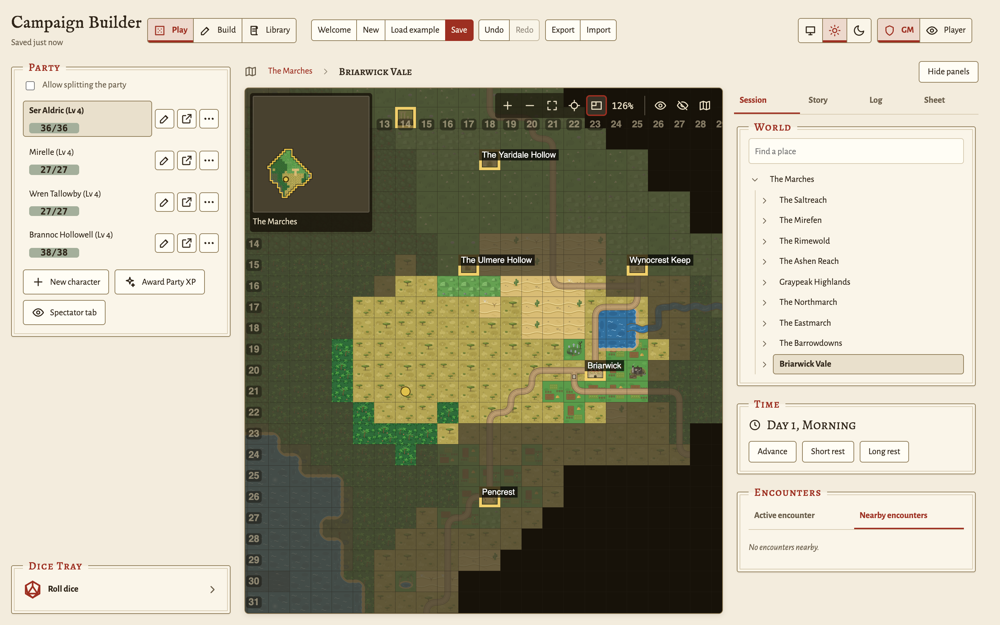
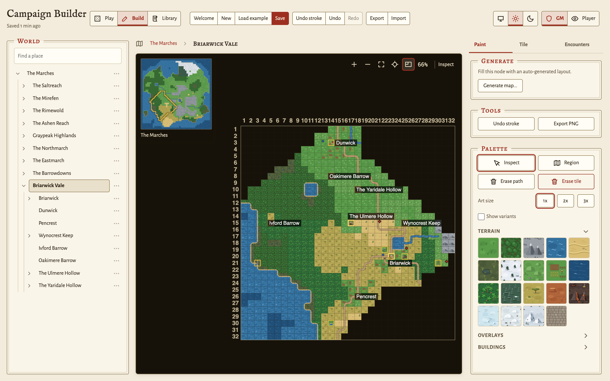

---
---
# Campaign Builder

Campaign Builder is a browser app for building and running the world of a D&D campaign, or of a similar tabletop campaign. It shows the world that the players move through: the map, the fog of war, the party, the fights, and the story so far. It does not act as the game master (GM). The GM makes every rules call and moves the story forward.

The app runs entirely in one browser tab. It has no server and no account. It keeps each campaign in the local storage of the browser, and you move a campaign between browsers with a JSON export file.

This site has the guides for GMs who run a campaign in the app, and for contributors who change its code. To try the app, open the [hosted build](https://cartographer.tbmh.org).



## Where to start

| You want to | Read |
| --- | --- |
| Run your first session with the example campaign | [First session as GM](tutorial-gm-first-session.md) |
| Find the steps for one task, such as painting a region or staging an encounter | [GM guide](gm-guide.md) |
| Look up a control, a field, a limit, or a rule | [GM reference](gm-reference.md) |
| Make your first change to the code | [Your first code change](tutorial-first-code-change.md) |
| Set up the tools, run the checks, and send a change | [Contributing](../CONTRIBUTING.md) |
| Learn how the code is organized | [Architecture](architecture.md) |

[All documents](README.md) lists every page by kind.

## Features

### World building

- Paint a tiled map with the built-in tile art, or generate a map with the procedural generator and then edit it.
- Nest maps in a hierarchy. A world contains regions, a region contains towns and dungeons, and a building contains its floors.
- Link a tile to a child map, so the party can zoom from a region into a town.
- Lock a map behind a key item. The party stops at the way in until a character carries the key or the GM unlocks it.
- Mark points of interest. Each tile has notes that only the GM sees.
- Get a warning in Build mode when a map has no way in or out.
- Export any map as a PNG image.

The data model accepts custom tile images, but the app has no control that adds one yet.

### Sessions

- Move the party across the map. The fog of war hides every area that the party has not seen, and it clears as the party walks.
- Light the rooms of a building, so the whole room shows when the party walks in.
- Leave a sub-region from any side that touches the map above it. Where two regions share a border, the party walks straight across into the next region.
- Take stairs and doors between the floors of a building.
- Split the party into more than one group on the map.
- See a mini-map in the corner inside a sub-region. It shows where the party stands on the map one level up.
- Advance an in-game clock of six watches per day, and take short and long rests. A walk tells the GM how much time it took, and asks before it runs into the night.
- Keep a quest log, a list of NPCs, handouts with pictures, and a travelogue of what happened.
- Let a finished quest reveal the quests it leads to, and pay out its gold and experience points to the party.
- Get a prompt when the party stands on the tile of a hidden handout.
- Bring an NPC along, so it travels with the party.

### Combat

- Run a fight on a full-width combat screen, with a turn ribbon above the initiative order.
- Pick a target from the combatant cards. Each card shows armor, weapons, and spell slots.
- Attack or cast with one click on the turn of the active combatant, and read the result in the combat log.
- Check the difficulty of a fight before it starts. The Encounters panel shows the experience-point value of the foes against the budget for the party's levels, and only the GM sees it.
- Add foes that stand nearby to a fight, before it starts or while it runs.
- Give a boss legendary actions and legendary resistance, and spend them from its combatant card.
- Keep a fight open after the last enemy falls, until the GM ends it.

### Characters and creatures

- Keep full character sheets: class and subclass, race, background, proficiencies, hit dice, and spellcasting.
- Level up one class level at a time, with multiclassing, subclasses, and a choice of an ability score improvement or a feat.
- Pick the choices of a class feature at level-up, such as the Expertise of the Rogue.
- Track items, spell slots, and other resources that a character uses up.
- Drink a healing potion, or any item that has heal dice, from the inventory.
- Keep every creature in one list, from major enemies with hit points to friendly and neutral NPCs. A creature has a challenge rating and its trained saving throws and skills, and the app works out each bonus.
- Roll any combination of dice in the dice tray.

### Library

- Curate templates for equipment, creatures, spells, and feats in Library mode. The templates do not belong to one campaign.
- Start from the built-in 5th edition (5e) defaults, and override or add entries.
- Export your library to a JSON file. Save the file over `library/campaign-library.json`, and every new browser or clone loads it at startup.
- Include the library in a campaign export. A campaign import offers to restore it.

### Player displays

- Open a second browser tab in the Player role for a screen that the players see. A Player tab shows only the revealed map, and it shows enemy health as a band instead of exact hit points.
- Bind a Player tab to one character, so that player runs their own turns in a fight.
- Keep the tabs of one browser in step. Each save in the GM tab reaches the other tabs without a reload.

The Player role hides GM information on the screen, but it is not a security control. A person at that browser can read the whole campaign from its storage. See [Limits of the Player view](gm-reference.md#limits-of-the-player-view).

### Appearance

- Switch between the light and dark themes in the header, or follow the setting of the operating system. The app keeps the choice for each browser.




## Local setup

You need [Node.js](https://nodejs.org/) 22 or later and [pnpm](https://pnpm.io/) 11.

1. Clone the [repository](https://github.com/wetherc/cartographer), and open a terminal in it.
2. Install the development tools:

   ```bash
   pnpm install
   ```

3. Start the dev server:

   ```bash
   pnpm run dev
   ```

4. Open `http://127.0.0.1:8080` in a browser.

The app opens in Play mode with a blank campaign. On the first visit, a **Welcome, GM** card offers three ways to start: build by hand, generate a world, or load the example campaign. Click **Welcome** in the header to open the card again. At any time, click **Load example** in the header to load the example campaign. If port 8080 is in use, the dev server fails to start, so stop the other process first.

The hosted build can be older than the source in this repository. Each origin has its own local storage, so a campaign that you save on the hosted build does not appear on your dev server. Use **Export** and **Import** to move it.
